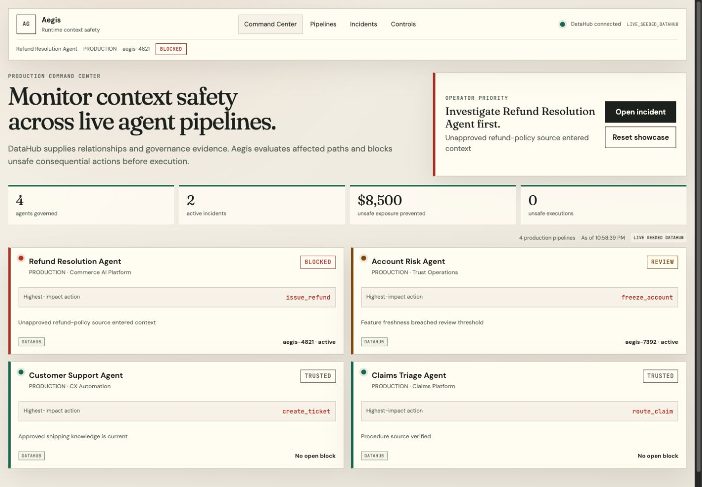

# Aegis

Aegis is a DataHub-native safety control plane for agentic systems. It catalogs agents,
context, skills, and MCP tools in DataHub; uses live lineage and operational metadata as
governance evidence; and intercepts consequential tool calls before they reach a sandbox
executor.



## Why Aegis stands out

Most governance tools describe what an agent is connected to. Aegis uses that catalog context
as runtime evidence: immediately before a consequential MCP call, it re-reads DataHub, evaluates
an inspectable deterministic control, and permits execution only through an exact-argument,
short-lived, single-use capability.

- **Last-mile enforcement:** the model proposes; Aegis authorizes.
- **Fresh evidence:** cached metadata and change events never authorize execution.
- **Fail-closed controls:** outages, missing lineage, stale evidence, tampering, and replay remain safe.
- **Inspectable proof:** judges can see the cause, affected path, decision, prevented action,
  executor receipt state, recovery, and DataHub write-back in one product flow.
- **Portable showcase:** the full incident story runs without cloud credentials, while the online
  profile proves the same boundary with real DataHub and OpenAI calls.

The demo has two real LangGraph agents:

- **Refund Resolution** reads DataHub through its read-only MCP server, retrieves a case
  through the Aegis business MCP server, asks an OpenAI model to propose `issue_refund`,
  then applies the `ApprovedContextSource` control.
- **Account Risk** retrieves risk lineage and its latest DataHub Operation, asks the model
  to propose `freeze_account`, then applies the `FreshRiskContext` control.

Customer Support and Claims Triage are intentionally catalog-only. All external side effects
are simulated, but agent reasoning, MCP calls, DataHub reads, gating, capability checks, and
trace persistence are real.

## Quick start: UI and deterministic incident story

Requirements: Docker Desktop with Compose v2.

```bash
cp .env.example .env
docker compose up --build -d
scripts/demo/verify.sh
```

Open [http://localhost:8000](http://localhost:8000). This seeded mode runs the complete
four-route UI and deterministic incident/remediation story without external credentials. It
deliberately does **not** permit the two live agents to execute.

```bash
scripts/demo/hero.sh
```

For a judge-ready walkthrough, use **Reset showcase** in the Command Center and follow the
[90-second submission script](docs/submission.md). The additional Support and Claims incidents
are explicitly labeled showcase fixtures; the Refund incident remains the interactive lifecycle.

## What is real versus simulated

| Surface | Behavior |
| --- | --- |
| LangGraph agents, OpenAI proposals, DataHub MCP reads | Real in online mode |
| Fresh direct GMS enforcement reads and deterministic controls | Real in online mode |
| Capability binding, expiry, one-time consumption, and audit persistence | Real |
| DataHub incident and attestation write-back | Real in online mode |
| Refund and account restriction consequence | Sandboxed receipt; never a real business action |
| Support and Claims history | Clearly labeled showcase fixtures |

## Online DataHub agent mode

Online mode requires DataHub Core 1.7+ (or an Agent Registry-enabled DataHub Cloud deployment)
and an OpenAI API key.
Seed the Aegis catalog model, verify the exact aspects Aegis relies on, then start the online
profile:

```bash
# Set AEGIS_DATA_MODE=live and OPENAI_API_KEY in .env first.
docker compose build
docker compose run --rm --no-deps aegis python scripts/datahub/seed.py
docker compose run --rm --no-deps aegis python scripts/datahub/verify.py
docker compose --profile online up -d
```

Open Refund Resolution or Account Risk from the Command Center and use the live console.
See [the online demo runbook](docs/online-demo.md) for DataHub setup, event wiring, demo
sequences, and troubleshooting.

## What DataHub does

- **Agent Registry:** four agents, their versions, skills, ownership, and tool dependencies.
- **Lineage:** policy → RAG index → refund agent and events → features → risk agent.
- **Structured Properties:** approval status, content hash, seed version, and governance facts.
- **Documents:** approved/draft policies, the Aegis control definition, and trusted
  post-remediation attestations.
- **Operations:** freshness evidence for account-risk decisions and refund document syncs.
- **Incidents:** Aegis opens and resolves the context-safety incident in DataHub.
- **Run-level writeback:** completed consequential runs publish attestation Documents; blocked
  or review runs publish active Incidents with the run, control, tool, and evidence details.
- **Actions:** metadata changes are forwarded to Aegis as authenticated, idempotent hints.
- **MCP:** agents discover and read catalog context through DataHub's read-only MCP server.

DataHub Core 1.7 stores and serves the Agent Registry metadata used by Aegis, but its OSS
frontend does not render Cloud Agent Registry profile pages. The pipeline UI therefore opens the
corresponding context dataset in local Core; native agent profiles require Agent Registry to be
enabled in DataHub Cloud.

DataHub Actions never authorize a consequential call. Immediately before execution, Aegis
re-reads the relevant GMS aspects, evaluates a deterministic control, and issues a short-lived,
single-use capability bound to the exact tool arguments only for `ALLOW`.
Run-level writeback happens after enforcement. If DataHub rejects the write, the original gate
decision remains authoritative and the execution trace exposes a failed writeback receipt.

## Truth and failure boundaries

| Condition | Live agent behavior |
| --- | --- |
| No OpenAI credential | Admission rejected; no fake model fallback |
| Seeded mode | Admission rejected; fixture metadata cannot authorize tools |
| DataHub/GMS unavailable | Fail closed |
| Missing or incomplete lineage | Fail closed |
| Unapproved refund context and amount over $2,000 | Block |
| Risk Operation older than the SLA | Hold for review |
| Missing risk freshness evidence | Block |
| Valid `ALLOW` capability | Sandbox consequence recorded once |
| Replayed or tampered capability | Executor rejects it |

## Local development

Use Python 3.12 or 3.13 for the full DataHub runtime. The core API tests can also run on
Python 3.14.

```bash
make bootstrap
make dev
```

The frontend runs at [http://localhost:5173](http://localhost:5173) and proxies `/api` to
FastAPI at port 8000.

```bash
make test
make lint
make build
```

## Project map

- `apps/api/aegis` — API, controls, persistence, live agent runtime, and DataHub adapter
- `apps/api/aegis_mcp` — business context and capability-protected sandbox MCP tools
- `apps/api/aegis_actions` — authenticated DataHub Actions callback
- `apps/web/src` — React product UI, agent console, and incident trace
- `scripts/datahub` — idempotent DataHub seed and evidence verifier
- `infra/datahub` — structured properties and Actions configuration
- `docs/architecture.md` — runtime architecture and security boundaries
- `docs/online-demo.md` — complete online setup and demo runbook
- `docs/security.md` — trust boundaries and the scoped dependency advisory exception
- `docs/submission.md` — one-line pitch, 90-second demo, truth table, and judge checkpoints

The API schema is available at [http://localhost:8000/docs](http://localhost:8000/docs).

## License

MIT © 2026 Pranav Mahesh.
