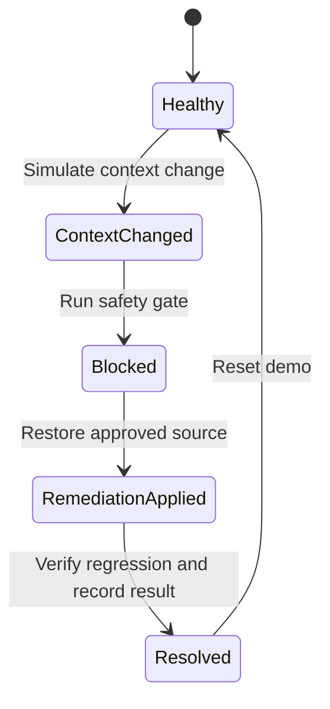
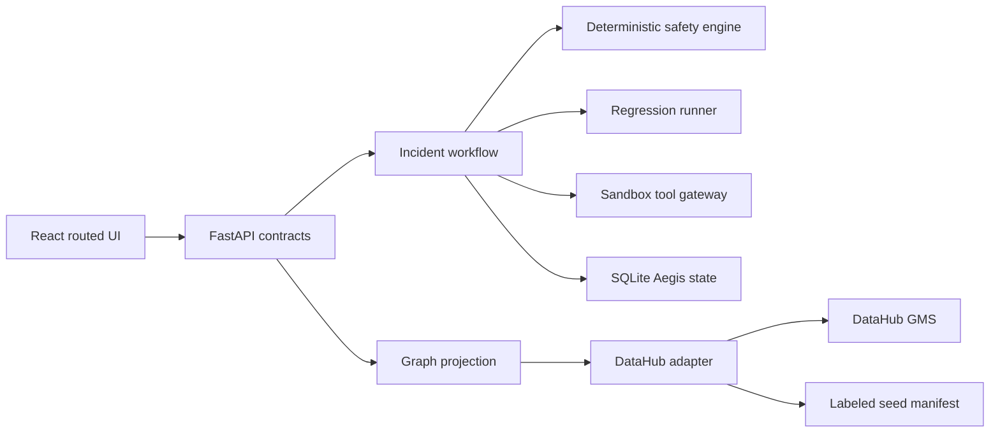

# Aegis implementation plan

> Delivery note (2026-08-07): the live architecture described after the original planning
> phase is now implemented. See `architecture.md` for the current runtime design and
> `online-demo.md` for the operational path. This file is retained as the historical delivery
> plan and acceptance record.

## 1. Executive recommendation

Aegis is implemented as one deployable application with clear internal modules:

- React 18, TypeScript, Vite, React Router, and TanStack Query for the four routed views.
- FastAPI and Pydantic for normalized contracts and deterministic workflow operations.
- SQLite for Aegis-owned incident, evaluation, attestation, regression, and audit state.
- DataHub 1.7 as the optional live catalog; a checked-in, visibly labeled seed projection is
  the deterministic fallback.
- A simulated runtime tool gateway. No LLM and no real payment integration are on the
  safety boundary.

This is the smallest architecture that delivers the connected fleet-to-incident journey
without hiding responsibilities in speculative microservices.

## 2. Current repository assessment

The repository began empty. The only source artifact was the standalone Open CoDesign export
at `/Users/pranav/Downloads/Aegis-Blocked-Agent-Prototype-App-2026-08-06-185046.html`.
It is a 3.2 MB generated container bundling React, ReactDOM, Babel, edit helpers, and multiple
unrelated design sources. Its accepted Aegis artifact is 36,888 bytes / 266 lines and is now
reproducibly extracted to `design/reference/aegis-open-codesign-artifact.jsx`.

Reusable design material:

- Warm cream/paper/ink palette with restrained red, green, and amber.
- Fraunces incident headlines, DM Sans UI text, and JetBrains Mono metadata.
- `StatusGlyph`, summary, lineage, evidence, and timeline interaction concepts.
- CSS variables, responsive composition, visible focus, and reduced motion.
- Healthy → changed → blocked → remediated interaction hierarchy.

Discarded export scaffolding:

- Embedded runtimes and Babel transpilation.
- Open CoDesign edit-mode helpers and unrelated `iOS.jsx` / `DesignCanvas.jsx` sources.
- Prototype-local navigation and monolithic local state.
- Static values that previously looked like operational data.

Canonical implementation paths are `apps/web/src` and `apps/api/aegis`. The extraction is
comparison-only and production code never imports it.

## 3. Product behavior and user journey

The breadth-to-depth flow is:

The Command Center makes the blocked refund exposure visible alongside review and trusted
pipelines. A pipeline route reveals only its relevant dependencies, permission, changes, and
attestation. The refund pipeline links to incident `aegis-4821`. The incident progressively
reveals its four-node causal path, control evidence, raw payloads, remediation, regression, and
write-back destination. Controls exposes the same inspectable deterministic rule. Resolution
updates the fleet query so the refund agent is trusted and its active incident disappears.

## 4. Target architecture

The frontend never receives raw DataHub payloads. The adapter normalizes catalog records and
labels provenance. The workflow owns state transitions and optimistic version checks. The safety
engine is pure and deterministic. The gateway checks the engine before calling the local
simulator. The regression runner reuses the same control boundary. SQLite is the source of truth
for mutable demo lifecycle state.

## 5. Data model

- Pipeline: stable ID, agent identity/version, environment, owner, trust, recent change,
  highest-impact action, incident link, provenance.
- Context asset: URN, entity kind, approval, version/hash, owner, environment, provenance.
- Tool: API URN, operation, risk class, scope, simulated execution contract.
- Incident: ID, pipeline, state, version, causal change, prevented action, next step, timestamps.
- Control: ID/version, scope, typed conditions, missing-evidence policy, latest evaluation.
- Evaluation: decision, reason code, evidence IDs, evaluated inputs, timestamp.
- Context Attestation: agent version and environment, decision, graph fingerprint, control and
  regression results, incident link, remediation state, evidence timestamp.
- Regression run: suite, scenarios, expected/actual decisions, pass/fail state.
- Audit event: append-only ID, kind, message, source system, timestamp, payload.
- Graph projection: normalized nodes/edges, selected path IDs, root change, capture metadata.

Attestations use a hybrid representation: the full operational record lives in Aegis persistence;
a compact summary is eligible for DataHub write-back. This keeps workflow state transactional
without forcing it into catalog aspects while preserving discoverability.

## 6. DataHub model and integration

The reproducible identities are:

| Role | Entity | URN |
| --- | --- | --- |
| Approved policy | Dataset | `urn:li:dataset:(urn:li:dataPlatform:aegis_context,policies/refund-policy-v12.md,PROD)` |
| Draft policy | Dataset | `urn:li:dataset:(urn:li:dataPlatform:aegis_context,policies/refund-policy-q4-draft.md,PROD)` |
| Retrieval index | Dataset | `urn:li:dataset:(urn:li:dataPlatform:pinecone,refund-rag-index,PROD)` |
| Agent | AI Agent | `urn:li:aiAgent:refund-resolution-agent-v2_8_4` |
| Tool | API | `urn:li:api:refund-service.issue_refund` |

`scripts/datahub/seed.py` uses verified DataHub 1.7 SDK surfaces: `Dataset`,
`DataHubClient.entities.upsert`, `lineage.add_lineage`, `Agent.emit`, `Api.emit`, and
`StructuredProperties.create`. It creates approval/hash/seed structured properties and the
policy → index → agent → tool evidence. `scripts/datahub/verify.py` reads entity aspects and
each relationship back. Exact relationship verification is required before live mode is trusted.

The checked-in projection remains labeled `SEEDED_DATAHUB`, even after a successful connection
probe, because presence is not the same as field-level query provenance. Live DataHub outage in
live mode causes the safety gate to block. Incident and attestation write-back is local and
explicit in seeded mode; the response names its destination instead of implying a catalog write.

## 7. Frontend architecture

Routes:

- `/` — Command Center.
- `/pipelines/:pipelineId` — pipeline detail.
- `/incidents` — incident queue.
- `/incidents/:incidentId` — incident workspace.
- `/controls` and `/controls/:controlId` — control inspection.

`AppShell` owns navigation and the persistent DataHub status banner. Feature pages own queries,
but TanStack Query shares cache and invalidates fleet, pipeline, incident, graph, controls, and
status after workflow mutations. React Router preserves real URLs and browser navigation.

`CausalPath` accepts normalized graph types only. Evidence and raw JSON require separate user
disclosures. Every route has loading and error recovery states. The visual system is split into
tokens, global primitives, and layout CSS. Media queries collapse dense rows, focus rings use
`:focus-visible`, and `prefers-reduced-motion` disables nonessential transition behavior.

## 8. Backend architecture

- `api/routes.py`: versioned request/response boundary and problem details.
- `domain/models.py`, `enums.py`, `transitions.py`: shared typed vocabulary and legal states.
- `adapters/datahub`: seed identities, health boundary, normalized facts, path projection.
- `controls/approved_context_source.py`: one explicit deterministic control.
- `services/safety_engine.py`: control execution and inspectable evaluation.
- `services/tool_gateway.py`: fail-closed interception before simulated execution.
- `services/regression_runner.py`: threshold, approval, lineage, and outage scenarios.
- `services/workflow.py`: transition orchestration, attestation, audit, remediation, resolution.
- `persistence/store.py`: SQLite schema, versioned state, JSON records, deterministic reset.

No policy language is introduced. The control is ordinary typed code. Any request with stale
incident version or an illegal transition returns `409 application/problem+json`.

## 9. API contracts

All contracts use JSON and enum strings. Mutation bodies carry `expectedVersion` to prevent stale
operators from applying an action to changed evidence.

- `GET /api/system/status`: API/frontend state, DataHub connection detail, data mode, seed version,
  projection capture metadata. Used by the shell.
- `GET /api/pipelines`: normalized summaries with provenance and optional incident link. Used by
  Command Center.
- `GET /api/pipelines/:id`: agent, dependencies grouped by kind, attestation, permission, changes,
  fact-source groups. Used by Pipeline detail.
- `GET /api/incidents`: compact summary queue with optional state filter.
- `GET /api/incidents/:id`: summary, attestation, actions, evidence, audit, write-back state.
- `GET /api/incidents/:id/graph`: `{rootChangeUrn, selectedPathNodeIds, nodes, edges, capturedAt,
  cached}`. Nodes and edges always include `sourceSystem`.
- `POST /api/demo/context-change`: pipeline/scenario and expected incident version; returns changed
  sources, new state/version, invalidated attestation, audit ID.
- `POST /api/incidents/:id/evaluate`: expected version and tool call; returns decision, execution
  flag, evaluation, version.
- `POST /api/incidents/:id/remediate`: expected version and restore strategy; returns old/new source,
  pinned hash, audit ID, version.
- `POST /api/incidents/:id/verify`: expected version and suite; returns regression, attestation,
  decision/trust, write-back destination, version.
- `POST /api/demo/reset` and `/api/demo/prime`: deterministic lifecycle reset.
- `GET /api/controls`: inspectable rule, scope, conditions, latest result, coverage, incident link.
- `POST /api/runtime/tools/issue_refund`: guarded simulation; returns decision, execution, evidence,
  and an optional local receipt only on allow.

Not found is `404`; validation is FastAPI `422`; workflow conflicts are typed `409`; unavailable
live DataHub causes a Block decision rather than an infrastructure-driven Allow.

## 10. Phased implementation plan

### Phase 0 — repository normalization and capability spikes

Extract the final Open CoDesign artifact, fingerprint it, verify DataHub 1.7 Agent/API/lineage
surfaces from the installed distribution, and establish Node 22 / Python 3.12 pins. Exit when the
accepted source is reproducible and unsupported SDK calls have been removed.

### Phase 1 — frontend scaffold and design system

Create the Vite/React/TypeScript scaffold, router, query client, application shell, tokens, global
styles, and layout rules. Port the accepted visual hierarchy into maintainable components. Exit
when a production build renders the shell with accessibility behaviors intact.

### Phase 2 — domain and deterministic state

Create typed models, transition validation, SQLite persistence, seed records, and reset/prime.
Write control and store tests first. Exit when state can reproduce either the trusted or blocked
opening without wall-clock-dependent content.

### Phase 3 — Command Center and pipeline navigation

Implement summaries, the four fleet records, pipeline detail, dependency groups, and Context
Attestations. Test blocked prioritization and route selection. Exit when all cards open working
details and trusted records do not invent incidents.

### Phase 4 — incident workspace

Port the summary, four critical facts, selected causal path, progressive evidence, raw metadata,
read-only timeline, and one primary action per state. Exit when the accepted visual interaction is
preserved through routed API state.

### Phase 5 — control and runtime gateway

Implement `ApprovedContextSource`, fail-closed missing-evidence behavior, evaluation persistence,
and the sandbox executor. Test allowed, unapproved, missing metadata, missing lineage, outage,
threshold boundary, and blocked non-execution. Exit when no blocked call can reach the simulator.

### Phase 6 — DataHub seed and verification

Create structured properties, datasets, lineage, Agent, and API with idempotent SDK writes.
Read each entity and relationship back. Exit when verification fails for any absent required fact
and seeded fallback is never displayed as a live query.

### Phase 7 — graph projection

Normalize the four-node affected path, graph statuses, evidence IDs, and source labels. Test that
only the selected path is rendered. Exit when raw DataHub payloads never cross into components.

### Phase 8 — remediation, regression, and write-back

Restore/pin v12, run deterministic scenarios, create a final attestation, resolve the incident,
and refresh fleet trust. Label the write-back destination. Exit when the complete journey ends
with trusted fleet state and the original blocked call is still recorded as not executed.

### Phase 9 — controls and failure states

Implement the Controls route, latest evaluation, audit evidence, errors, empty/loading recovery,
version conflicts, and degraded connection banner. Exit when every visible control works.

### Phase 10 — hardening and delivery

Run unit, API journey, component, type, lint, production-build, Docker health, responsive,
keyboard, and reduced-motion checks. Add the README, environment example, seed/verify/reset/hero
scripts, and judge-safe fallback. Exit when a clean checkout follows one documented path.

Suggested commit boundaries match the phase headings. No commit is created automatically.

## 11. Test and verification matrix

| Requirement | Automated evidence | Manual evidence |
| --- | --- | --- |
| Four fleet states and routing | Command Center component test; API top-level query test | Compare desktop/mobile layouts |
| Control decisions | `test_control.py` | Inspect Controls latest evaluation |
| Blocked executor isolation | API journey test | Raw intercepted-call evidence says `executed: false` |
| Complete recovery | healthy-to-resolved API test | Run incident primary actions |
| Graph normalization | causal path component test | Inspect four-node path only |
| State persistence/reset | store tests and demo reset | Refresh after mutation, then reset |
| DataHub model | `scripts/datahub/verify.py` | Inspect entities in DataHub UI |
| Outage behavior | safety-engine test | Start live mode with GMS down |
| Accessibility | semantic component queries | Keyboard navigation and focus review |
| Build/deploy | typecheck, Vite build, compileall, Docker health | Load the production container |

Canonical commands are `make test`, `make lint`, `make build`, `scripts/demo/verify.sh`, and,
when a local DataHub is present, `make datahub-verify`.

## 12. Demo runbook

1. Start Aegis and open Command Center; point out the visibly labeled data mode.
2. Reset to Healthy and open Refund Resolution Agent.
3. Simulate the draft policy entering context.
4. Run the safety gate; show Block and `executed: false` for the $8,500 call.
5. Open evidence and then deliberately reveal raw metadata.
6. Restore `refund-policy-v12.md` and its pinned hash.
7. Verify recovery; show the regression scenarios and attestation.
8. Return to Command Center and confirm Trusted with no active incident.
9. Show Controls and the latest `ApprovedContextSource` result.

`scripts/demo/hero.sh` performs the same state sequence against the API and prints every result.

## 13. Risks and de-risking work

- DataHub Agent Registry/version drift: pin 1.7.0, validate imports from the wheel, and keep all
  SDK usage isolated to two scripts and one adapter boundary.
- Relationship support: verify concrete aspects after seeding, not only UI search results.
- Write-back support: do not claim catalog write-back until a read-after-write verifier exists;
  seeded mode explicitly names `AEGIS_LOCAL_DEMO`.
- Export maintainability: keep it reference-only and test production components independently.
- Runtime enforcement: all execution flows through `ToolGateway`; no alternate payment client exists.
- Reproducibility: immutable seed version, reset endpoint, pinned packages, container health check.
- Outage: live mode fails consequential actions closed; seeded mode is separate and labeled.
- Scope expansion: retain one real control and one deep scenario instead of a generic policy engine.

## 14. Open questions

The supplied repository contains no authenticated DataHub environment or server version to prove
live incident/attestation write-back semantics. The implemented boundary therefore keeps those
records in Aegis and exposes the destination honestly. A future live-write spike must choose a
supported DataHub custom aspect, structured-property summary, or native incident capability and
add read-after-write verification before changing that claim.

## 15. Definition of done

- Four top-level routes and all primary controls function.
- The refund workflow runs deterministically from healthy through trusted recovery.
- The $8,500 call is blocked before execution and remains recorded as not executed.
- The exact causal path and evidence provenance are inspectable without raw payload coupling.
- Missing approval, lineage, or live DataHub availability fails closed.
- Resolution updates pipeline trust, incident state, regression evidence, and attestation.
- Seeded and live connection states cannot be confused in UI or API output.
- Unit, API, component, type, lint, build, Docker, and visual checks pass.
- A new user can run the judge-safe mode from the README without secrets.
