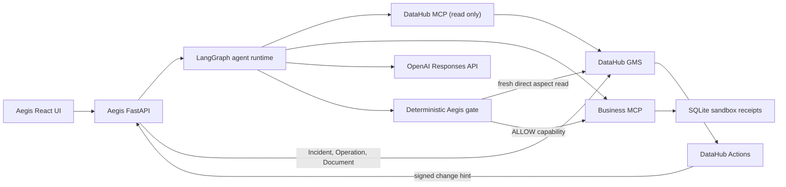

# Aegis runtime architecture

## System shape

## Execution sequence

1. The API admits only Refund Resolution and Account Risk, only in live mode, and only when
   an OpenAI credential is configured.
2. LangGraph queries DataHub MCP for discovery and lineage context.
3. The agent reads case/account facts through read-only business MCP tools.
4. The OpenAI model must emit one strict consequential function call.
5. Aegis discards any implied authorization from the model or Actions cache and re-reads the
   relevant GMS aspects directly.
6. A deterministic control returns `ALLOW`, `REVIEW`, or `BLOCK`.
7. Only `ALLOW` mints an HMAC capability containing run ID, tool, exact argument hash, expiry,
   and a one-time ID.
8. The business MCP executor verifies and consumes the capability atomically, then writes a
   sandbox receipt. Review, block, outage, tampering, and replay never reach this step.
9. Aegis writes the significant outcome back to DataHub: allowed and executed runs become
   attestation Documents; blocked or review runs become active Incidents.
10. Every stage, including the writeback receipt, is persisted as an Aegis run step and
    projected in the pipeline/incident UI.

Run writeback is downstream of enforcement. A writeback failure is visible, but it does not
change the gate decision or permit a tool call.

## DataHub model

| Entity or aspect | Aegis use |
| --- | --- |
| AI Agents and Agent Skills | Runtime identity, version, ownership, capabilities |
| API entities | MCP tool identity and consequence surface |
| Dataset lineage | Active context provenance and blast radius |
| Structured Properties | Approval status, content hash, seed identity |
| Documents | Human-readable policies, controls, and attestations |
| Operation timeseries | Freshness evidence for the risk agent |
| Incident | Cross-system record of the unsafe context event |
| Actions event | Low-latency invalidation hint, never enforcement evidence |

## Control semantics

`ApprovedContextSource` applies to production `issue_refund` calls. DataHub outage or missing
lineage blocks. An amount over $2,000 also requires the active upstream policy to be approved;
the $8,500 attack case is therefore blocked after the model proposes the call.

`FreshRiskContext` applies to production `freeze_account`. Missing DataHub evidence or lineage
blocks. A present but stale latest DataHub Operation produces review instead of execution.

## Deployment modes

Seeded mode exists only for a portable UI and deterministic workflow demonstration. Its facts
are visibly labeled and are never accepted by the live agent gateway. Live mode uses DataHub
MCP for agent context and direct GMS reads for enforcement. The same catalog model and verifier
work against self-hosted DataHub Core or a configured DataHub Cloud GMS endpoint.
